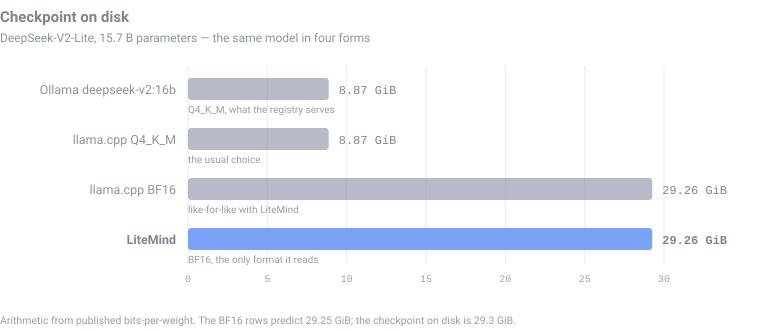
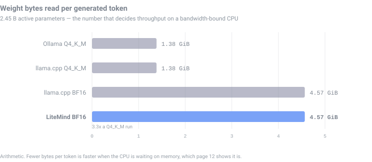
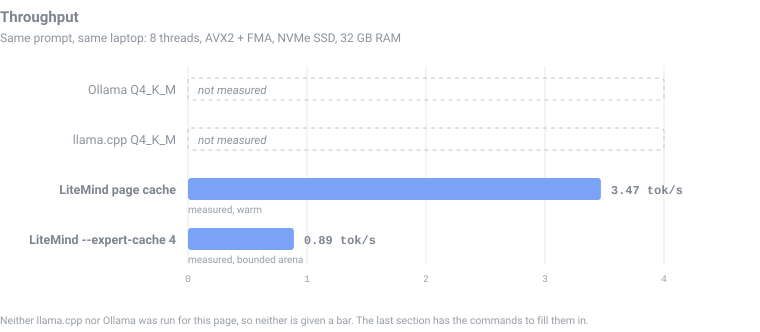
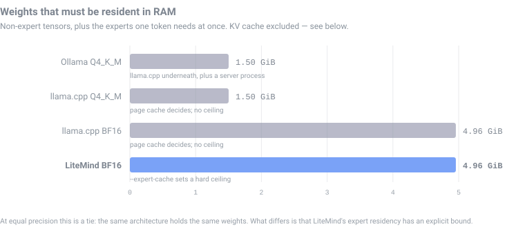
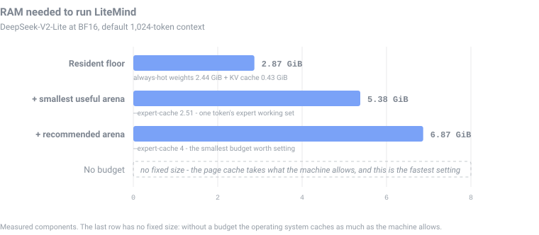

# 15 · Comparison and requirements

Where LiteMind sits next to [llama.cpp](https://github.com/ggml-org/llama.cpp)
and [Ollama](https://ollama.com), and what a machine actually needs to run it.

## What is measured here and what is not

This matters more than any number on the page.

| | |
|---|---|
| **Measured** | Every LiteMind figure. Taken from the runs in [Performance](12-performance.md): a Windows laptop, 8 hardware threads, AVX2 + FMA, NVMe SSD, 32 GB RAM, DeepSeek-V2-Lite. |
| **Arithmetic** | Every file size and bytes-per-token figure for a quantised model. Computed from the published bits-per-weight of each GGUF type against this checkpoint's own parameter counts — not read off a disk. Real GGUF files land a few percent higher, because embedding and output tensors are usually kept at higher precision than the body. |
| **Not measured at all** | llama.cpp and Ollama throughput. Neither was run for this page. |

No llama.cpp or Ollama timing is quoted anywhere below, because none was taken.
[The last section](#producing-real-numbers) is the recipe for producing them, if
you want the table filled in properly.

The arithmetic is worth trusting on one point of evidence: applied to BF16 it
predicts **29.25 GiB**, and the checkpoint on disk is **29.3 GiB**. The method
reproduces the one file size that can be checked.

## The three engines

| | |
|---|---|
| **llama.cpp** | The reference CPU inference engine. C++, GGUF weights, dozens of architectures, quantisation from 2 to 8 bits, CUDA/Metal/Vulkan back ends. Memory-maps the weight file by default. |
| **Ollama** | A model manager and HTTP server built over llama.cpp. Adds a registry, a pull command, automatic memory fitting and a chat API. The inference underneath is llama.cpp. |
| **LiteMind** | About 6,800 lines across 39 files, C++20, standard library only. One architecture, one element type, CPU only. Memory-maps the checkpoint and pages it at the granularity of a single expert. |

They are not competing for the same job. llama.cpp is a production runtime for
every model; LiteMind runs one model unquantised and shows its working.

## The checkpoint on disk

Quantisation is the whole story. LiteMind reads the weights in the precision
they were trained in; the others almost always read a compressed copy.



| Format | Bits/weight | File | Storage needed |
|---|---|---|---|
| **BF16 — what LiteMind reads** | 16 | **29.3 GiB** | 30 GiB free |
| `Q8_0` | 8.5 | 15.5 GiB | 16 GiB free |
| `Q5_K_M` | 5.67 | 10.4 GiB | 11 GiB free |
| `Q4_K_M` — the common default | 4.85 | 8.9 GiB | 9 GiB free |

**On storage, LiteMind is the expensive one — about 3.3× a Q4\_K\_M file.** It
is reading the original weights. There is no version of this trade where
unquantised is smaller.

## Bytes per generated token

This is the number that predicts speed. [Performance](12-performance.md)
establishes that throughput here is a bandwidth question, not an arithmetic one:
every token reads its active parameters from RAM or from the SSD, and the CPU
waits.

Only 2.45 B of the 15.7 B parameters are active per token, so this is 15.6% of
the file either way — the quantisation ratio simply carries straight through.



Measured against that: LiteMind reaches **3.47 tok/s** with the page cache
warm. A Q4\_K\_M run moves a third of the bytes on the same hardware, so it
should be substantially faster. **How much faster is not stated here, because it
was not measured** — which is what the two open bars below mean. LiteMind's own
performance page reaches the same conclusion from the inside: quantisation is
listed there as "the biggest win by far".



## What has to stay in RAM

Here the comparison is not about size but about *control*, and the honest
version has two halves.



LiteMind's floor is small and known:

| | |
|---|---|
| Always-hot weights (attention, norms, embeddings, shared experts) | 2.44 GiB |
| KV cache at the default 1,024-token context | 0.43 GiB |
| **Resident floor** | **2.87 GiB** |
| One token's expert working set — 156 experts × 16.5 MiB | 2.51 GiB |

The routed experts, 26.81 GiB of them, are never all resident. They arrive from
the mapping as the router asks and leave when something else needs the space.

**llama.cpp's floor is lower, not higher.** It memory-maps too, and its
non-expert tensors at Q4\_K\_M come to roughly 0.74 GiB. Any claim that LiteMind
needs less RAM than llama.cpp would be false.

What LiteMind has that llama.cpp does not is a **hard, explicit ceiling**.
`--expert-cache 4` bounds expert residency at 4 GiB — not a hint to the page
cache, an arena with a fixed size and an LRU eviction policy. That is the
difference between "usually fits" and "fits". llama.cpp offers `--no-mmap` and
`--mlock`, which are the two extremes, and MoE offload flags aimed at splitting
experts across a GPU — not a bounded CPU-side expert budget.

And measured, on a machine with RAM to spare, that ceiling is the *slower*
choice — 0.89 tok/s against 3.47. It exists for the machine that cannot afford
the fast path, and [Performance](12-performance.md#the-counter-intuitive-result)
explains why in detail.

## Minimum requirements



| | Minimum | Recommended | Measured configuration |
|---|---|---|---|
| **RAM** | 8 GB, with `--expert-cache 4` | 16 GB | 32 GB |
| **Storage** | 30 GiB free, **SSD** | NVMe SSD | NVMe SSD |
| **CPU** | Any 64-bit | x86-64 with AVX2 + FMA | 8 threads, AVX2 + FMA |
| **GPU** | None. There is no GPU path at all. | | |
| **Throughput to expect** | Below 1 tok/s on a bounded arena | ~3.5 tok/s with RAM to spare | 3.47 tok/s |

Three of those are hard limits rather than preferences:

**An SSD, not a hard disk.** A 32-token run reads 95.5 GiB of expert weights
when nothing is cached. On a mechanical drive that is not slow, it is unusable.

**Never set `--expert-cache` below 2.51 GiB.** One token touches exactly that
much of the expert weights, so a smaller arena evicts every expert before the
token that wanted it has finished — a 0% hit rate by construction, and worse
than either extreme. Use `0` or at least `4`.

**AVX2 is a speed floor, not a requirement.** Without it the build falls back to
portable scalar kernels, which are correct and much slower. `scripts\build.ps1`
selects this automatically; the startup banner says which one is compiled in.

Context length is the one knob that changes the RAM floor at runtime: the KV
cache costs **438.75 KiB per position**, so `--context 4096` adds about 1.3 GiB
over the default.

## Where each one wins

Stated plainly, because a comparison that only flatters its own subject is not
worth reading.

**Use llama.cpp or Ollama when** you want speed, a model that is not
DeepSeek-V2, GPU acceleration, quantisation, batching, an OpenAI-compatible
server, or anything production. All of that is what they are for, and LiteMind
has none of it.

**LiteMind is worth its cost when:**

| | |
|---|---|
| **The weights must stay unquantised** | Q4\_K\_M is 4.85 bits standing in for 16. Whatever that costs in accuracy, LiteMind does not pay it — the arithmetic runs on the numbers that were trained. |
| **Expert residency has to be bounded** | A fixed arena with LRU eviction, not a hint to the page cache. |
| **The mechanism has to be visible** | `--routing` reports the 156 experts behind every token; `--json` reports the plan before the work starts; the plan's predictions match the run's counters exactly. |
| **Nothing may be installed** | No BLAS, no vcpkg, no Python, no CUDA, no package manager. A compiler and the standard library. |
| **The code has to be readable end to end** | About 6,800 lines against a codebase of hundreds of thousands. Every part of this documentation points at a file you can read in an afternoon. |

The first and last of those are the real ones. This engine exists to run a
mixture-of-experts model in the precision it was trained in, on hardware that
cannot hold it, and to be legible while doing it.

## Producing real numbers

To replace the arithmetic above with measurements, run both engines on the same
machine, on the same prompt, against the same architecture.

```powershell
# LiteMind, the numbers already on this page
.\build\bin\LiteMind.exe models -p "The capital of France is" -n 32

# llama.cpp on the same checkpoint, quantised
.\llama-cli.exe -m DeepSeek-V2-Lite-Chat-Q4_K_M.gguf `
                -p "The capital of France is" -n 32 -t 8 --no-mmap

# Ollama, which is llama.cpp underneath
ollama run deepseek-v2:16b --verbose "The capital of France is"
```

Record for each: the file size on disk, peak working set from Task Manager or
`Get-Process`, wall-clock load time, and tokens per second. Compare runs from
the same session — hit rates climb as the page cache warms, so a cold first run
is not comparable with a warm third one.

Two things to keep the comparison fair: LiteMind reads BF16, so a BF16 GGUF is
the only like-for-like row, and a quantised row is a different experiment
measuring what quantisation buys. And `--no-mmap` above makes llama.cpp's memory
use visible in the process rather than hidden in the page cache, which is the
only way the two numbers mean the same thing.

Next: back to the [documentation index](README.md).
